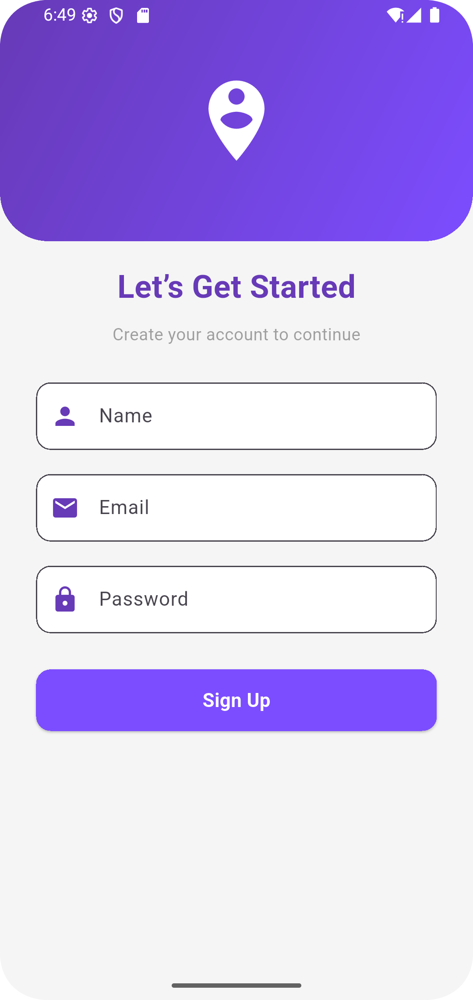
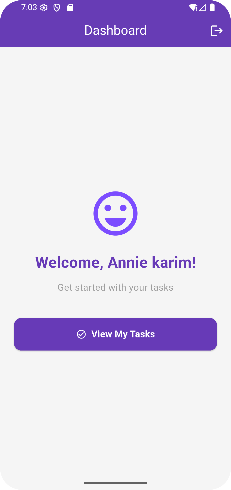
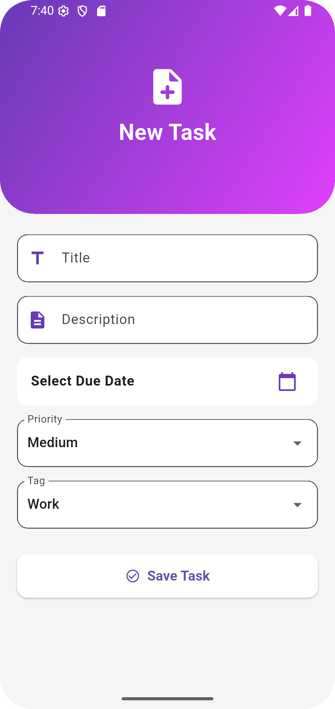
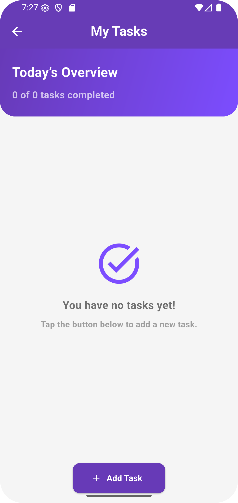
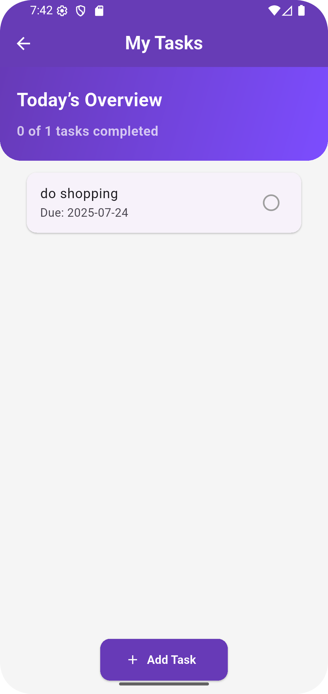

#  A To-Do list App with Provider (Flutter)

A clean and beautiful **Flutter To-Do list App** built using `Provider` for state management. This app includes a polished **authentication flow, dashboard, task management screens**, and modern UI design – all structured with clean architecture.

##  Features

- ✅ Beautiful splash screen with animated transition
- 👤 Signup screen with name, email & password
- 🏠 Modern dashboard with gradient cards
- 📋 Add/Edit/View Tasks with custom fields
- 🎯 Task tagging with priority & due date
- ☑️ Mark as completed / delete task
- 🔄 State management using `Provider`
- 🎨 Material 3 styling with gradients & rounded corners


##  Screenshots

<p float="left">
  
  
  
</p>

<p float="left">
  
  
</p>

---

## 📂 Folder Structure

```bash
lib/
├── main.dart
├── models/
│   └── task_model.dart
├── provider/
│   └── task_provider.dart
├── screens/
│   ├── splash_screen.dart
│   ├── signup_screen.dart
│   ├── dashboard_screen.dart
│   ├── home_screen.dart
│   ├── add_task_screen.dart
│   ├── edit_task_screen.dart
│   └── task_detail_screen.dart
├── widgets/
│   ├── task_tile.dart
│   └── custom_input_field.dart
└── utils/
    └── theme.dart
```

---

## 🛠️ Packages Used

```yaml
dependencies:
  flutter:
    sdk: flutter
  provider: ^6.1.1
```

---

##  Getting Started

```bash
git clone https://github.com/your-username/taska_app
cd taska_app
flutter pub get
flutter run
```

---

##  Notes

- No backend or Firebase used – local state only
- Fully extendable to use Firebase, local DB, etc.
- App works offline – uses `Provider` to manage app-wide state

---

##  Developer

Built by Annie Karim  – feel free to fork and contribute 💜

---

**Feel free to star ⭐ the repo if you like the project!**
